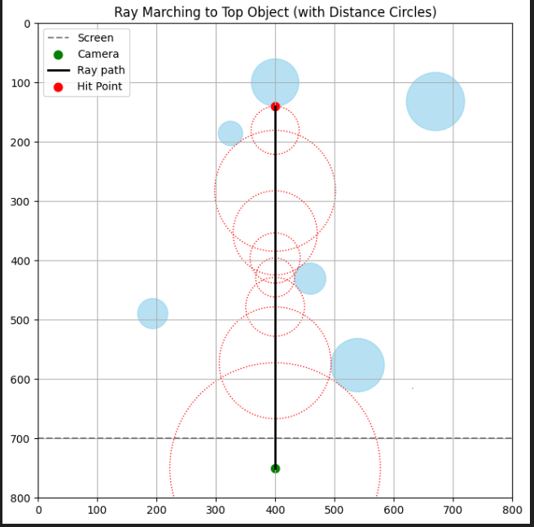

# Lab 13: Ray Marching from Camera Through Screen (2D Visualization)

## Scene Specification

- The canvas is **800 × 800 pixels**.
- A **camera** is located at the bottom center.
- A horizontal **screen** is positioned just above the camera.
- A single **ray** is cast **straight upward** from the camera, through the screen.
- Multiple **circular objects** are placed above the screen in the scene.
- The ray **marches** through the scene:
  - At each step, it evaluates the distance to the nearest object.
  - A **circle is drawn** at the current point with a radius equal to that distance.
- The ray terminates once it hits an object (i.e., distance is less than a small epsilon).

---

## Tasks & Deliverables

1. **Scene Setup**

   - Initialize a canvas of size 800×800.
   - Place the camera at the bottom center and a horizontal screen above it.
   - Create **5 or more randomly placed circular objects** above the screen using a signed distance function.
   - Add one fixed circle near the top center as the **main hit target**.

2. **Ray Marching Implementation**

   - Emit a ray from the camera vertically upward.
   - March the ray step-by-step using the minimum distance to the nearest object.
   - Store and visualize each ray step.
   - Stop the ray when it hits any object (distance < epsilon) or exceeds a max number of steps.

3. **Visualization**
   - Plot the camera and screen.
   - Plot all circular objects in the scene.
   - Show the ray’s path as a solid line.
   - Draw **distance circles** at each step along the ray.
   - Mark the final hit point in a distinct color (e.g., red).

## Example

